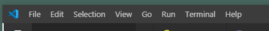

# My Coding Test

#### Asynchronousity project for Epicodus, 06.30.2020

## By Brittany Lindgren

## Description

If you want to test your knowledge of HTML, CSS and JavaScript, this app will help you. By taking the quiz, you'll be able to confirm which concepts you've got down solid and which are still fuzzy. Then, you'll be able to review the fuzzy ones to help you learn and re-inforce your knowledge.

## Setup/Installation Requirements

| Steps | Example |
| -------- | ----- |
| Follow this [link to the project repository](https://github.com/LINDGRENBA/my-coding-test) on GitHub.   |  [Link to the project repository](https://github.com/LINDGRENBA/my-coding-test)  |    
| Click on the "Clone or download" button to copy the project link.   |      |   
| If you are comfortable with the command line, you can copy the project link and clone it through your command line with the command `git clone`. Otherwise, I recommend choosing "**Download ZIP**".   |     |   
|  Once the ZIP file has finished downloading, you can right click on the file to view the zip folder in your downloads.   |     |   
| Right click on the project ZIP folder that you have just downloaded and choose the option "**Copy To...**", then choose the location where you would like to save this folder.    |     |   
| Navigate to the final location where you have chosen to save the project folder.   |    |   
| To view the code itself, right click, choose "open with..." and open using a text editor such as VS Code or Atom, etc.   |     |
|  Once you have cloned or downloaded the project and opened it in VS Code or another text editor, open a new terminal by navigating to Terminal -> New Terminal. A terminal will open on the page.  |   |
| In the terminal type the command `npm install` to install node modules. You should see a file called node_modules appear  |    |
| You can now view the project in your browser by typing the command `npm run start` in the terminal  | `npm run start` |

## Setup/Installation of Node.js and npm

| Steps | Example |
| -------- | ----- |

#### Additional Setup/Installation Notes:

* You will need to run npm install to install the node modules necessary to run this project. 

* Run a server to view this document using npm start.  

## Specifications

| Behavior | Input | Output |  Achieved(Y/N?)  | 
| -------- | ----- | ------ | -------- |
|    Program will create a quiz object with total score, an array of questions and a variable to target the index of the array     |    n/a   |   quiz {totalScore: 0, questions = [], index: 0}    |     N     |
|    Program will create a flashcard object with the question, an array of possible answers and the correct answer     |    n/a    |    flascard{question: "What's javascript?", possAnswers = ["A city in North Dakota", "An new species of animal", correctAnswer: "A programming language"], "A programming language"}    |     N     |
|     If user does not answer question, answers wrong or if time runs out, question will be added to an array to be cycled through later     |   User skips question, user selects wrong answer   |   wrongArray.push(unanswered/incorrectly answered question flashcard)   |     N    |
|     If user selects correct answer, totalScore will increase     |   user chooses correct answer    |    score ++     |     N     |
|     For each new card, timer will re-start     |    new flashcard    |    timer resets to 30 seconds    |     N     |
|          |       |        |          |
|          |       |        |          |

## Front End Goals Corresponding to Specifications

| Related Spec | User Action | Front End Display | Achieved(Y/N?) |
| Program will create quiz object  |  User clicks "start quiz"  |  front end displays first question  |  N  |
| n/a  |  User clicks submit button  |  front end displays next question  |  N  |
| n/a  |  User clicks skip button  |  front end displays next question  |  N  |
| For each new card, timer will re-start  |  user submits answer  |  new flashcard displays, timer shows 30 sec to answer question  |  N  |
|   |   |   |   |
|   |   |   |   |

## Known Bugs

| Location (html/css/js & specific location if known) |  Message  | Bug | Resolved (Y/N) |  How was the issue resolved?  |
| ------- | ----- | ------ | ------ | --------- |
|  |  |  |  |  |

## Support and contact details

Please feel free to contact me through GitHub (username: LINDGRENBA) with any questions, ideas or concerns.  

## Technologies Used

* HTML5
* CSS3
* Bootstrap v-4.5.0
* JavaScript
* jQuery v-3.5.0
* Visual Studio Code 
* Git and Git BASH 
* Node.js
* npm package manager
* Webpack

### License

*This site is licensed under the MIT license.*

Copyright (c) 2020 **Brittany A Lindgren_**